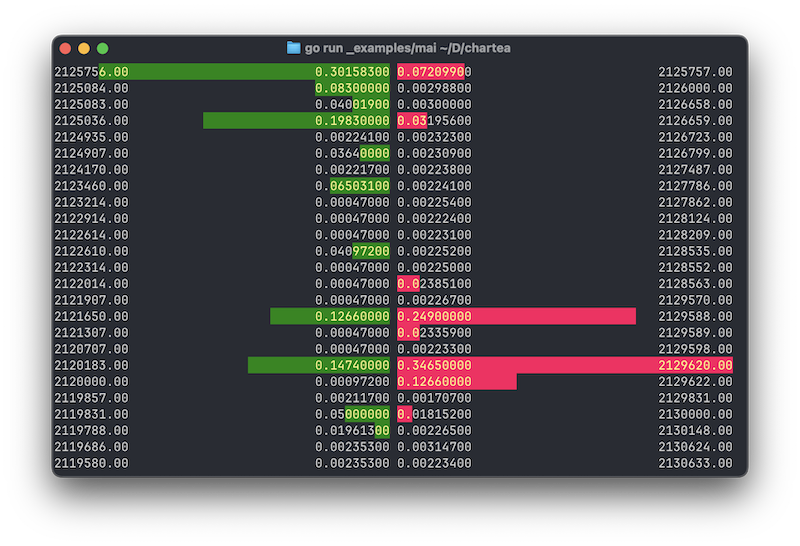
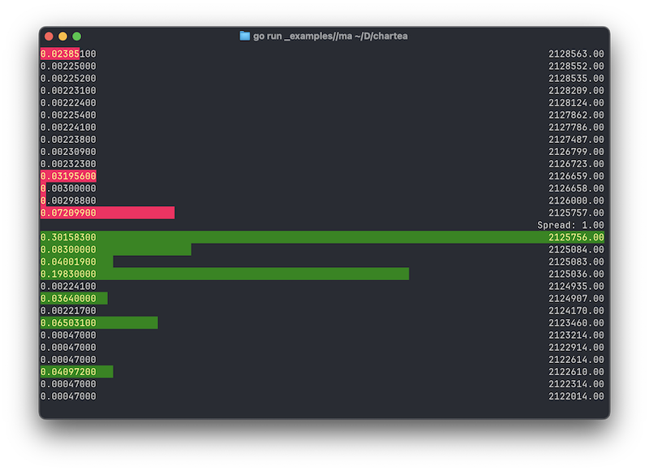
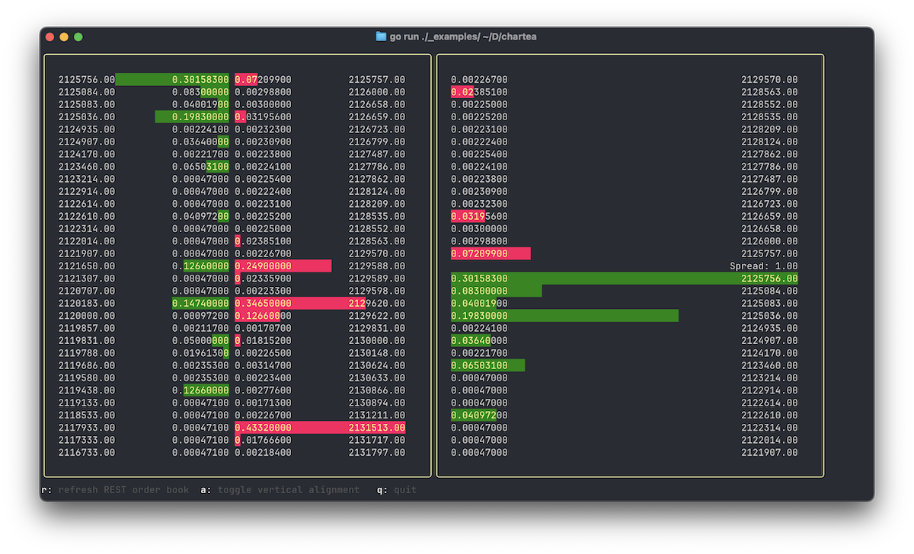

# Chartea - An order book component for Bubble Tea

A simple, reusable central limit order book (CLOB) component for [Bubble Tea](https://github.com/charmbracelet/bubbletea) applications.





_Data from [https://api.luno.com/api/1/orderbook_top?pair=BTCZAR](https://api.luno.com/api/1/orderbook_top?pair=BTCZAR) at 2025-10-04 08:00 SAST_
## Installation

```bash
go get github.com/allank/chartea
```

## Usage

Here's a simple example of how to use the `clob` component in your Bubble Tea application:

```go
package main

import (
	"log"
	"os"

	"github.com/allank/chartea/clob"

	tea "charm.land/bubbletea/v2"
)

// mainModel represents the state of our TUI application.
type mainModel struct {
	clob   clob.Model
	width  int
	height int
}

// InitialModel creates the initial state of the application model.
func InitialModel() mainModel {
	m := mainModel{
		clob: clob.New(),
	}
	m.clob.ApplySnapshot(
		[]clob.Order{
			{Price: 100, Volume: 5},
			{Price: 101, Volume: 10},
			{Price: 102, Volume: 20},
		},
		[]clob.Order{
			{Price: 99, Volume: 1},
			{Price: 98, Volume: 20},
			{Price: 97, Volume: 40},
		},
	)

	return m
}

// Init is the first command that is run when the program starts.
func (m mainModel) Init() tea.Cmd {
	return nil
}

// Update handles all incoming messages and updates the model accordingly.
func (m mainModel) Update(msg tea.Msg) (tea.Model, tea.Cmd) {
	switch msg := msg.(type) {
	case tea.WindowSizeMsg:
		m.width = msg.Width
		m.height = msg.Height
	case tea.KeyPressMsg:
		switch msg.String() {
		case "ctrl+c", "q":
			return m, tea.Quit
		}
	}

	var cmd tea.Cmd
	m.clob, cmd = m.clob.Update(msg)
	return m, cmd
}

// View renders the UI based on the current model state.
func (m mainModel) View() tea.View {
	return tea.NewView(m.clob.View())
}

func main() {
	p := tea.NewProgram(InitialModel())

	if _, err := p.Run(); err != nil {
		log.Fatalf("Alas, there's been an error: %v", err)
		os.Exit(1)
	}
}
```

## Example

The included example in the `_examples` directory demonstrates mock data, static REST snapshots, and live WebSocket streaming order book updates using the [Kraken API](https://docs.kraken.com).

### Running the Example

- **Realtime Mode (Live WebSocket Streaming)**:
  ```bash
  go run -C _examples . -market BTC/USD -realtime
  ```
- **Static Mode (One-off REST Snapshot)**:
  ```bash
  go run -C _examples . -market BTC/USD
  ```
- **Mock Mode (Offline Testing)**:
  ```bash
  go run -C _examples .
  ```

### TUI Features & Keybindings

The example displays side-by-side order book views using horizontal orientation on the left and vertical on the right:
- Press **`v`** to toggle orientation (Horizontal vs Vertical).
- Press **`a`** to toggle vertical volume bar alignment (Left vs Right).
- Press **`r`** to refresh static order book data.
- Press **`q`** or **`Ctrl+C`** to quit.



## The order book

**Breaking change:** prior versions exposed `Bids` and `Asks` as public fields on `OrderBook`. They are now unexported — populate the book via `ApplySnapshot`/`ApplyDelta` and read it via `Bids()`/`Asks()` (see [API Reference](#api-reference)).

The `clob.Model` requires an `OrderBook`. Populate it by calling `ApplySnapshot(asks, bids []Order)` to replace the book's contents wholesale (an initial load, or a full snapshot from an exchange), or `ApplyDelta(asks, bids []Order)` to merge incremental updates (streaming L2 updates: a zero-volume level removes that price, otherwise it inserts or updates the level's volume). Each `Order` has a `Price` and a `Volume`. Both methods sort the book for you as part of applying the update — asks ascending by price, bids descending — so the book is always correctly ordered as soon as you've applied an update, not just at render time.

### Grouping

You can view the book at a coarser price resolution by calling `GroupedBids(increment)`/`GroupedAsks(increment)`, which aggregate the raw Orders into price Buckets of the given Increment. Bids round down to the nearest Increment, asks round up, and the volumes of every Order that lands in the same Bucket are summed — so grouping never loses volume, only price resolution. An Increment of zero (or negative) returns the book unchanged — every raw Order, ungrouped. Grouping is a pure read: it doesn't modify the `OrderBook`, so `Bids()`/`Asks()` always retain full granularity and you can re-group at a different Increment at any time.

## Customization

You can customize the appearance and behavior of the `clob` component by setting the fields on the `clob.Model`.

### Orientation

You can choose how the order book is displayed by setting the `Orientation` on the `clob.Model` to either `Horizontal` or `Vertical`.

When `Horizontal` (default), the bids and asks will be displayed side by side, bids on the left and asks on the right.  Best bid and best ask will be at the top.

When `Vertical`, the bids and asks will be displayed stacked, asks on the top, bids on the bottom.  Best ask will be at the bottom of the asks and best bid will be at the top of the bids.  When using `Vertical` orientation, the spread between best bid and best ask is also shown.

The `Vertical` orientation also supports an `Alignment`.  When this is set to `AlignLeft` (default), the volume and coloured volume bar are shown on the left, with price on the right.  When this is set to `AlignRight`, the volume and coloured volume bar are shown on the right, with price on the left.

### Dimensions

You can set the width and height of the component by passing a `clob.ViewOptions` struct to the `ViewWithOptions` function.

```go
func (m mainModel) View() tea.View {
	return tea.NewView(m.clob.ViewWithOptions(clob.ViewOptions{Width: m.width / 2, Height: m.height / 2}))
}
```

The side by side bids and asks will be displayed within the contraints of the provided with (or full terminal width if not provided), and the number (depth) of orders will be limited to the provided height.

### Styling

You can override the default colors by setting the `StyleOnBid`, `StyleOnAsk`, and `StyleOffBar` fields on the `clob.Model`.

- `StyleOnBid` is used to show the bar representing the bid volume, and any text displayed within the bar.  Defaults to light grey text on a green background.
- `StyleOnAsk` is used to show the bar representing the ask volume, and any text displayed within the bar.  Defaults to light grey text on a red background.
- `StyleOffBar` is used to show the area not covered by the volume bar, and any text.  Defaults to an `AdaptiveColor` using light grey and dark grey.


```go
func InitialModel() mainModel {
	m := mainModel{
		clob: clob.New(),
	}

	// Override default styles
	m.clob.StyleOnBid = lipgloss.NewStyle().
		Foreground(lipgloss.Color("228")).
		Background(lipgloss.Color("64"))
	m.clob.StyleOnAsk = lipgloss.NewStyle().
		Foreground(lipgloss.Color("228")).
		Background(lipgloss.Color("164"))

	// ... (rest of your model initialization)

	return m
}
```

### Spacing

You can adjust the spacing between the bid and ask columns by setting the `Spacing` field on the `clob.Model`.

```go
func InitialModel() mainModel {
	m := mainModel{
		clob: clob.New(),
	}

	m.clob.Spacing = 4

	// ... (rest of your model initialization)

	return m
}
```

### Precision

You can set the precision of the price and volume by setting the `PricePrecision` and `VolumePrecision` fields on the `clob.Model`.

```go
func InitialModel() mainModel {
	m := mainModel{
		clob: clob.New(),
	}

	m.clob.PricePrecision = 4
	m.clob.VolumePrecision = 0

	// ... (rest of your model initialization)

	return m
}
```

## API Reference

### `clob.New()`

Creates a new `clob.Model` with default styles.

### `(m *Model) ViewWithOptions(opts ViewOptions)`

Renders the CLOB with the given options.

### `(b *OrderBook) ApplySnapshot(asks, bids []Order)`

Replaces the book's contents with the given levels. Zero-volume entries in the input are dropped, and both sides are sorted (asks ascending, bids descending) before replacing the prior contents.

### `(b *OrderBook) ApplyDelta(asks, bids []Order)`

Merges the given levels into the book by price: a level matching an existing price updates its volume, a zero-volume update removes that price level, and an update for an unmatched price with non-zero volume is inserted. Both sides are re-sorted after merging.

### `(b *OrderBook) Bids() []Order`

Returns the current bid levels, sorted descending by price.

### `(b *OrderBook) Asks() []Order`

Returns the current ask levels, sorted ascending by price.

### `(b *OrderBook) GroupedBids(increment float64) []Order`

Returns the current bids aggregated into price Buckets of the given increment, rounded down, with volume summed within each Bucket. `increment <= 0` returns the current bids unchanged.

### `(b *OrderBook) GroupedAsks(increment float64) []Order`

Returns the current asks aggregated into price Buckets of the given increment, rounded up, with volume summed within each Bucket. `increment <= 0` returns the current asks unchanged.

### `clob.Model`

*   `OrderBook`: The order book data, embedded in `Model`. Populate it via `ApplySnapshot`/`ApplyDelta` and read it via `Bids()`/`Asks()` — see above.
*   `Orientation`: The orientation of the order book (`Horizontal` or `Vertical`).
*   `Alignment`: The alignment of the volume and price in `Vertical` orientation (`AlignLeft` or `AlignRight`).
*   `Spacing`: The space between the bid and ask columns.
*   `PricePrecision`: The number of decimal places for the price.
*   `VolumePrecision`: The number of decimal places for the volume.
*   `StyleOffBar`: The style for the "off" part of the volume bar.
*   `StyleOnBid`: The style for the bid volume bar.
*   `StyleOnAsk`: The style for the ask volume bar.
