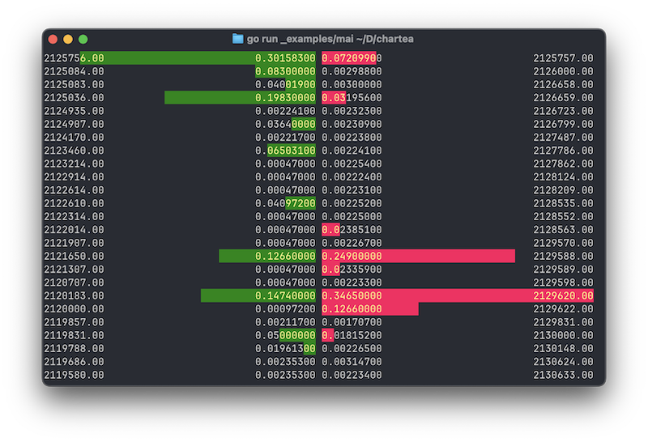

# Chartea - An order book component for Bubble Tea

A simple, reusable central limit order book (CLOB) component for [Bubble Tea](https://github.com/charmbracelet/bubbletea) applications.




_Data from [https://api.luno.com/api/1/orderbook_top?pair=BTCZAR](https://api.luno.com/api/1/orderbook_top?pair=BTCZAR) at 2025-10-04 08:00 SAST_
## Installation

```bash
go get github.com/allank/chartea
```

## Usage

Here's a simple example of how to use the `clob` component in your Bubble Tea application:

```go
package main

import (
	"log"
	"os"

	"github.com/allank/chartea/clob"

	tea "github.com/charmbracelet/bubbletea"
	"github.com/charmbracelet/lipgloss"
)

// mainModel represents the state of our TUI application.
type mainModel struct {
	clob   clob.Model
	width  int
	height int
}

// InitialModel creates the initial state of the application model.
func InitialModel() mainModel {
	m := mainModel{
		clob: clob.New(),
	}
	m.clob.Asks = []clob.Order{
		{Price: 100, Volume: 5},
		{Price: 101, Volume: 10},
		{Price: 102, Volume: 20},
	}
	m.clob.Bids = []clob.Order{
		{Price: 99, Volume: 1},
		{Price: 98, Volume: 20},
		{Price: 97, Volume: 40},
	}

	return m
}

func main() {
	p := tea.NewProgram(InitialModel(), tea.WithAltScreen())

	if _, err := p.Run(); err != nil {
		log.Fatalf("Alas, there's been an error: %v", err)
		os.Exit(1)
	}
}
```

## Example

The included example in the `_examples` folder can be run with `go run ./_examples/main.go`.

The example allows you to toggle between `Horizontal` and `Vertical` orientation by pressing the `v` key.

When in `Vertical` orientation, you can toggle between `AlignLeft` and `AlignRight` by pressing the `a` key.

```
## The order book

The `clob.Model` requires an `OrderBook`.  An `OrderBook` has two fields, `Bids` and `Asks`, each of which is a slice of `Order`.  Each `Order` has a `Price` and a `Volume`.  The `Bids` and `Asks` do not need to be sorted, this is done internally before displaying.

## Customization

You can customize the appearance and behavior of the `clob` component by setting the fields on the `clob.Model`.

### Orientation

You can choose how the order book is displayed by setting the `Orientation` on the `clob.Model` to either `Horizontal` ro `Vertical`.

When `Horizontal` (default), the bids and asks will be displayed side by side, bids on the left and asks on the right.  Best bid and best ask will be at the top.

When `Vertical`, the bids and asks will be displayed stacked, asks on the top, bids on the bottom.  Best ask will be at the bottom of the asks and best bid will be at the top of the bids.  When using `Vertical` orientation, the spread between best bid and best ask is also shown.

The `Vertical` orientation also supports an `Alignment`.  When this is set to `AlignLeft` (default), the volume and coloured volume bar are shown on the left, with price on the right.  When this is set to `AlignRight`, the volume and coloured volume bar are shown on the right, with price on the left.

### Dimensions

You can set the width and height of the component by passing a `clob.ViewOptions` struct to the `ViewWithOptions` function.

```go
func (m mainModel) View() string {
	return m.clob.ViewWithOptions(clob.ViewOptions{Width: m.width / 2, Height: m.height / 2})
}
```

The side by side bids and asks will be displayed within the contraints of the provided with (or full terminal width if not provided), and the number (depth) of orders will be limited to the provided height.

### Styling

You can override the default colors by setting the `StyleOnBid`, `StyleOnAsk`, and `StyleOffBar` fields on the `clob.Model`.

- `StyleOnBid` is used to show the bar representing the bid volume, and any text displayed within the bar.  Defaults to light grey text on a green background.
- `StyleOnAsk` is used to show the bar representing the ask volume, and any text displayed within the bar.  Defaults to light grey text on a red background.
- `StyleOffBar` is used to show the area not covered by the volume bar, and any text.  Defaults to an `AdaptiveColor` using light grey and dark grey.


```go
func InitialModel() mainModel {
	m := mainModel{
		clob: clob.New(),
	}

	// Override default styles
	m.clob.StyleOnBid = lipgloss.NewStyle().
		Foreground(lipgloss.Color("228")).
		Background(lipgloss.Color("64"))
	m.clob.StyleOnAsk = lipgloss.NewStyle().
		Foreground(lipgloss.Color("228")).
		Background(lipgloss.Color("164"))

	// ... (rest of your model initialization)

	return m
}
```

### Spacing

You can adjust the spacing between the bid and ask columns by setting the `Spacing` field on the `clob.Model`.

```go
func InitialModel() mainModel {
	m := mainModel{
		clob: clob.New(),
	}

	m.clob.Spacing = 4

	// ... (rest of your model initialization)

	return m
}
```

### Precision

You can set the precision of the price and volume by setting the `PricePrecision` and `VolumePrecision` fields on the `clob.Model`.

```go
func InitialModel() mainModel {
	m := mainModel{
		clob: clob.New(),
	}

	m.clob.PricePrecision = 4
	m.clob.VolumePrecision = 0

	// ... (rest of your model initialization)

	return m
}
```

## API Reference

### `clob.New()`

Creates a new `clob.Model` with default styles.

### `(m *Model) ViewWithOptions(opts ViewOptions)`

Renders the CLOB with the given options.

### `clob.Model`

*   `OrderBook`: The data for the order book.
*   `Orientation`: The orientation of the order book (`Horizontal` or `Vertical`).
*   `Alignment`: The alignment of the volume and price in `Vertical` orientation (`AlignLeft` or `AlignRight`).
*   `Spacing`: The space between the bid and ask columns.
*   `PricePrecision`: The number of decimal places for the price.
*   `VolumePrecision`: The number of decimal places for the volume.
*   `StyleOffBar`: The style for the "off" part of the volume bar.
*   `StyleOnBid`: The style for the bid volume bar.
*   `StyleOnAsk`: The style for the ask volume bar.
